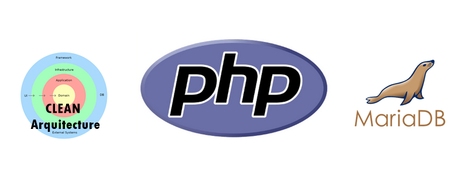

<h1 align="center"> FelipedelosH </h1>
<br>
<h4>CRUD PHP CLEAN ARQUITECTURE</h4>


<br>
:construction: IN CONSTRUCTION :construction:
<br><br>
This repository contains my practice project for connecting to MariaDB using PHP and implementing a CRUD (Create, Read, Update, Delete) application following Clean Architecture principles, specifically Domain-Driven Design (DDD).

## :hammer:Funtions:

- `Function 1`: C: create new Examples entities and insert in database.<br>
- `Function 2`: R: read a query with $q = id or name or word in description and return the macth examples.<br>
- `Function 3`: U: update a example and save in database.<br>
- `Function 4`: D: delete example in database<br>

## Architecture (Layer)

```
/project-root
|-- config/
|-- controllers/
|-- includes/
|   |-- header.php
|   |-- footer.php
|   |-- TEMPLATES.php
|-- js/
|   |-- scripts.js
|-- models/
|-- repositories/
|-- services/
|-- index.php
```

## :play_or_pause_button:How to execute a project

Install XAMPP createe a database with Docs/sql.sql (remember update you DB credentianls in config/env.php)

## :hammer_and_wrench:Tech.

- PHP

## :warning:Warning.

- you need create a database and update credentials

## Autor

| [<br><sub>Andrés Felipe Hernánez</sub>](https://github.com/felipedelosh)|
| :---: |